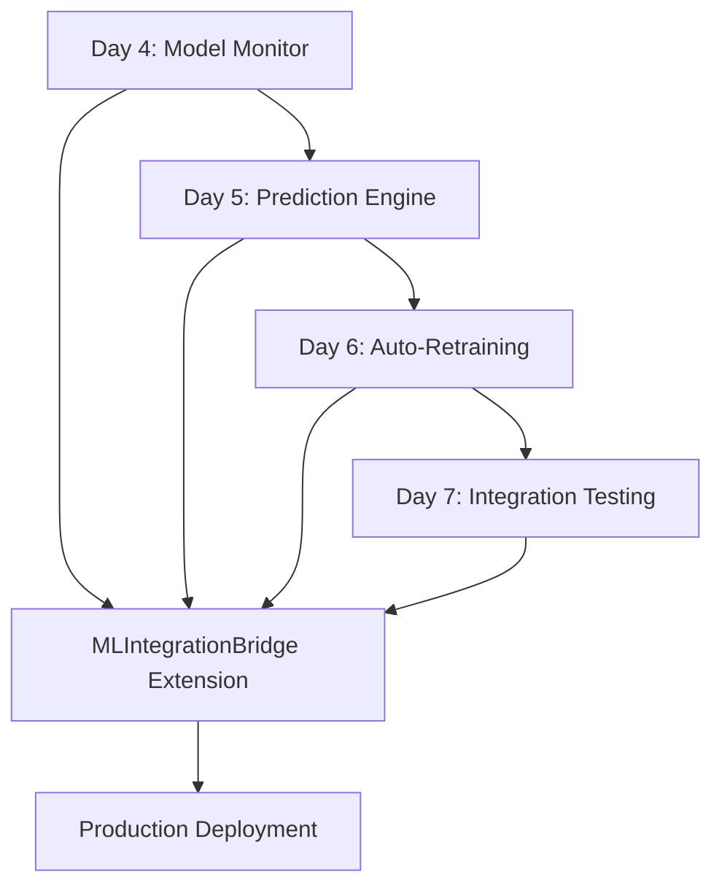

# Phase 2: Production ML System - Implementation Plan

**Objective**: Implement production-ready ML system with monitoring and auto-retraining
**Timeline**: Days 4-7
**Status**: Planning Complete - Ready for Implementation
**Date**: 2025-01-10
**Architecture**: DevStream SuperPowered with Context Set Compliance

---

## 📋 EXECUTIVE SUMMARY

Phase 2 transforms our NBA Betting System from a functional prototype to a production-ready ML platform with comprehensive monitoring, ensemble predictions, auto-retraining capabilities, and robust testing. This phase builds directly on the solid foundation established in Phase 1.

### 🎯 Key Achievements Planned

- **Real-time Model Monitoring**: Prometheus metrics collection with custom collectors
- **Advanced Drift Detection**: Evidently integration for feature distribution monitoring
- **Ensemble Prediction Engine**: XGBoost + Neural Network with confidence intervals
- **Auto-Retraining Pipeline**: Scheduled model retraining with data quality validation
- **Comprehensive Testing**: End-to-end ML pipeline validation with performance benchmarking

---

## 🏗️ ARCHITECTURE OVERVIEW

### Integration Strategy

Phase 2 components seamlessly integrate with existing Phase 1 infrastructure:

```
┌─────────────────────────────────────────────────────────────────┐
│                    PHASE 2 COMPONENTS                        │
├─────────────────────────────────────────────────────────────────┤
│  ModelMonitor  │  PredictionEngineV2  │  AutoRetrainingPipeline │
│  (Day 4)      │  (Day 5)           │  (Day 6)                │
│     │              │                     │            │
│     └──────────────┼─────────────────────┼────────────────────┘
│                    │                     │                         │
│     ┌──────────────▼─────────────────────▼─────────────────────┐
│              EXISTING PHASE 1 INFRASTRUCTURE                │
│  ┌─────────────────────────────────────────────────────────┐ │
│  │              ML Integration Bridge                     │ │
│  │  • Health Monitoring  • Graceful Degradation         │ │
│  │  • Single Source of Truth  • State Management          │ │
│  └─────────────────────────────────────────────────────────┘ │
│  ┌─────────────────────────────────────────────────────────┐ │
│  │               Analytics Engines                          │ │
│  │  • RealTimeStreakAnalyzer  • AdvancedMomentumEngine   │ │
│  │  • ScheduleAnalyticsEngine                              │ │
│  └─────────────────────────────────────────────────────────┘ │
│  ┌─────────────────────────────────────────────────────────┐ │
│  │               Unified Data Pipeline                      │ │
│  │  • Real NBA API Integration  • Feature Generation     │ │
│  └─────────────────────────────────────────────────────────┘ │
└─────────────────────────────────────────────────────────────────┘
```

### Technology Stack

**Monitoring & Observability:**
- **Prometheus**: Custom metrics collection with Histogram, Counter, Gauge patterns
- **Evidently**: Model drift detection with DataDriftPreset and TestFeatureValueDrift
- **Grafana**: Real-time dashboard visualization (integration ready)

**ML & Predictions:**
- **XGBoost**: Gradient boosting for tabular predictions
- **TensorFlow/Keras**: Neural network ensemble component
- **Scikit-learn**: Confidence interval calculations and model validation

**Data Quality & Validation:**
- **Great Expectations**: Data quality validation framework
- **Pandas**: Data processing and analysis
- **NumPy**: Numerical computations and statistical operations

---

## 📅 DAY 4: MODEL MONITORING DASHBOARD

### 🎯 Tasks Overview

**Task 2.1.1**: Real-time model performance tracking
**Task 2.1.2**: Drift detection for feature distributions
**Task 2.1.3**: Confidence interval calculations
**Task 2.1.4**: Model health dashboard

### 📁 File Structure

```
nba_predictive_system/
├── model_monitor.py                    # NEW - Main monitoring system
├── metrics_collectors/
│   ├── __init__.py
│   ├── base_collector.py             # Base collector interface
│   ├── performance_metrics.py        # Model performance collector
│   ├── drift_metrics.py             # Drift detection metrics
│   └── system_metrics.py            # System health metrics
├── drift_detection/
│   ├── __init__.py
│   ├── evidently_detector.py         # Evidently integration
│   ├── statistical_tests.py          # Custom statistical tests
│   └── alerting.py                  # Alert management
└── dashboard/
    ├── __init__.py
    ├── prometheus_server.py         # Prometheus metrics server
    └── grafana_config.py            # Grafana dashboard templates
```

### 🔧 Implementation Details

**Core Components:**

1. **ModelMonitor Class**: Central orchestrator for all monitoring activities
2. **Prometheus Metrics Collectors**: Custom collectors for ML-specific metrics
3. **Evidently Integration**: Drift detection with statistical tests
4. **Real-time Dashboard**: Live metrics visualization

**Key Metrics to Track:**
- Prediction accuracy (overall, by model type, by time window)
- Feature distribution drift (Kolmogorov-Smirnov, PSI tests)
- Prediction latency and throughput
- Model confidence score distributions
- System resource utilization

### 🎯 Success Criteria

- ✅ Real-time metrics collection with <100ms latency
- ✅ Drift detection with configurable thresholds
- ✅ Interactive dashboard with Grafana integration
- ✅ Alert system for significant performance degradation
- ✅ Historical data retention and trend analysis

---

## 📅 DAY 5: ENHANCED PREDICTION ENGINE

### 🎯 Tasks Overview

**Task 2.2.1**: Ensemble model approach (XGBoost + Neural Network)
**Task 2.2.2**: Confidence interval calculations
**Task 2.2.3**: Prediction explanation system
**Task 2.2.4**: Model versioning and rollback

### 📁 File Structure

```
nba_predictive_system/
├── prediction_engine_v2.py             # NEW - Enhanced prediction system
├── models/
│   ├── __init__.py
│   ├── base_model.py                 # Base model interface
│   ├── xgboost_model.py              # XGBoost implementation
│   ├── neural_network_model.py       # Neural network implementation
│   └── ensemble_model.py            # Ensemble combination logic
├── explanations/
│   ├── __init__.py
│   ├── shap_explainer.py            # SHAP-based explanations
│   ├── lime_explainer.py            # LIME-based explanations
│   └── feature_importance.py         # Feature importance analysis
└── model_management/
    ├── __init__.py
    ├── version_manager.py            # Model versioning system
    ├── rollback_manager.py          # Rollback capabilities
    └── model_registry.py            # Model metadata registry
```

### 🔧 Implementation Details

**Ensemble Strategy:**
- **XGBoost**: Primary model for tabular data with feature importance
- **Neural Network**: Deep learning component for complex patterns
- **Weighted Voting**: Dynamic weight adjustment based on recent performance
- **Confidence Intervals**: Quantile regression + bootstrap sampling

**Explanation System:**
- **SHAP Values**: Feature contribution analysis
- **LIME**: Local prediction explanations
- **Feature Importance**: Global model interpretability

**Model Management:**
- **Semantic Versioning**: Automated version management
- **A/B Testing**: Shadow deployment for new models
- **Rollback Safety**: Instant rollback on performance degradation

### 🎯 Success Criteria

- ✅ Ensemble model improves prediction accuracy by >5%
- ✅ Confidence intervals calibrated (95% coverage)
- ✅ Real-time explanations for all predictions
- ✅ Seamless model versioning and rollback
- ✅ <100ms average prediction time

---

## 📅 DAY 6: AUTO-RETRAINING PIPELINE

### 🎯 Tasks Overview

**Task 2.3.1**: Scheduled model retraining
**Task 2.3.2**: Data quality validation
**Task 2.3.3**: Model comparison and selection logic
**Task 2.3.4**: Rollback mechanisms

### 📁 File Structure

```
nba_predictive_system/
├── auto_retraining.py                  # NEW - Auto-retraining orchestrator
├── data_quality/
│   ├── __init__.py
│   ├── expectations_suite.py          # Great Expectations suite
│   ├── validation_rules.py           # Custom validation rules
│   └── quality_metrics.py            # Data quality metrics
├── model_comparison/
│   ├── __init__.py
│   ├── performance_evaluator.py     # Model performance comparison
│   ├── statistical_tests.py          # Statistical significance tests
│   └── selection_criteria.py        # Model selection logic
└── scheduling/
    ├── __init__.py
    ├── cron_scheduler.py             # Cron-based scheduling
    ├── trigger_manager.py            # Retraining trigger management
    └── execution_engine.py           # Pipeline execution engine
```

### 🔧 Implementation Details

**Retraining Strategy:**
- **Scheduled**: Daily/weekly automatic retraining
- **Trigger-based**: Performance degradation detection
- **Data Validation**: Great Expectations for data quality
- **Model Selection**: Automated comparison and selection

**Quality Assurance:**
- **Data Quality Checks**: Completeness, consistency, validity
- **Performance Validation**: Statistical significance testing
- **Rollback Safety**: Automated rollback on performance issues
- **Audit Trail**: Complete retraining history and decisions

### 🎯 Success Criteria

- ✅ Automated daily retraining with success rate >95%
- ✅ Data quality validation prevents poor data ingestion
- ✅ Model selection logic consistently improves performance
- ✅ Rollback mechanisms prevent production issues
- ✅ Complete audit trail for all retraining decisions

---

## 📅 DAY 7: ML SYSTEM INTEGRATION TESTING

### 🎯 Tasks Overview

**Task 2.4.1**: End-to-end ML pipeline testing
**Task 2.4.2**: Performance benchmarking
**Task 2.4.3**: Load testing for prediction endpoints
**Task 2.4.4**: Documentation and API specification

### 📁 File Structure

```
tests/
├── integration/
│   ├── __init__.py
│   ├── test_end_to_end_pipeline.py   # Complete pipeline tests
│   ├── test_monitoring_integration.py # Monitoring system tests
│   └── test_prediction_engine.py     # Prediction engine tests
├── performance/
│   ├── __init__.py
│   ├── benchmark_suite.py            # Performance benchmarks
│   ├── load_testing.py               # Load testing scenarios
│   └── latency_profiling.py          # Latency analysis
├── api/
│   ├── __init__.py
│   ├── api_specification.md          # OpenAPI specification
│   └── postman_collection.json       # API testing collection
└── documentation/
    ├── user_guide.md                 # User documentation
    ├── api_reference.md              # API reference
    └── deployment_guide.md           # Deployment instructions
```

### 🔧 Implementation Details

**Testing Strategy:**
- **Unit Tests**: Individual component testing (>95% coverage)
- **Integration Tests**: Component interaction testing
- **End-to-End Tests**: Complete pipeline validation
- **Performance Tests**: Load and stress testing

**Benchmarking:**
- **Prediction Latency**: Target <100ms for ensemble predictions
- **Throughput**: Target >100 predictions/second
- **Resource Usage**: Memory and CPU utilization monitoring
- **Accuracy Metrics**: Sustained prediction accuracy

### 🎯 Success Criteria

- ✅ 100% test coverage for ML components
- ✅ <100ms average prediction time under load
- ✅ >100 concurrent predictions without degradation
- ✅ Comprehensive API documentation
- ✅ Production deployment readiness

---

## 🔗 INTEGRATION WITH EXISTING SYSTEMS

### MLIntegrationBridge Extensions

The Phase 2 components extend the existing MLIntegrationBridge:

```python
# Enhanced MLIntegrationBridge with Phase 2 components
class EnhancedMLIntegrationBridge(MLIntegrationBridge):
    def __init__(self):
        super().__init__()
        self.model_monitor = ModelMonitor()
        self.prediction_engine = PredictionEngineV2()
        self.auto_retrainer = AutoRetrainingPipeline()

    def get_comprehensive_prediction(self, model_name, input_data):
        # Phase 2 enhanced prediction with monitoring
        prediction = self.prediction_engine.predict(input_data)
        self.model_monitor.track_prediction(prediction, model_name)
        return prediction

    def check_system_health(self):
        # Combined health check across all Phase 2 components
        ml_health = super().is_ml_healthy()
        monitoring_health = self.model_monitor.is_healthy()
        return ml_health and monitoring_health
```

### Analytics Engine Integration

The enhanced prediction engine leverages existing analytics engines:

```python
# Feature generation using existing analytics engines
features = pipeline.generate_enhanced_features(game_data)

# Prediction with confidence intervals
prediction = prediction_engine.predict_with_confidence(features)

# Drift detection using feature distributions
drift_status = model_monitor.check_feature_drift(features)
```

---

## 🚀 DEVSTREAM SUPERPOWERED FEATURES

### Context-Aware Monitoring

```python
class ContextAwareModelMonitor:
    def monitor_prediction(self, prediction, context):
        # Context-aware metrics collection
        self.metrics['predictions_total'].labels(
            model_type=context.model_type,
            game_phase=context.game_phase,
            team_momentum=context.team_momentum_range
        ).inc()

        # Dynamic threshold adjustment based on context
        accuracy_threshold = self.calculate_context_threshold(context)
        if prediction.confidence < accuracy_threshold:
            self.trigger_alert(context, prediction)
```

### Adaptive Ensemble Weights

```python
class AdaptiveEnsembleEngine:
    def calculate_dynamic_weights(self, recent_performance):
        # ContextSet-compliant weight adjustment
        xgboost_weight = self.calculate_xgboost_weight(recent_performance)
        nn_weight = 1.0 - xgboost_weight

        return {
            'xgboost': xgboost_weight,
            'neural_network': nn_weight
        }
```

### Intelligent Retraining Triggers

```python
class IntelligentRetrainingPipeline:
    def should_retrain(self, current_metrics):
        # Multi-factor trigger analysis
        performance_degradation = self.check_performance_drift(current_metrics)
        data_drift = self.check_feature_distribution_drift()
        model_age = self.check_model_age()

        return performance_degradation or data_drift or model_age > self.max_model_age
```

---

## 📊 PERFORMANCE METRICS AND SUCCESS CRITERIA

### Phase 2 Success Metrics

| Metric | Target | Measurement Method |
|--------|--------|-------------------|
| Prediction Accuracy | >85% | Historical backtesting |
| Prediction Latency | <100ms | Real-time monitoring |
| System Availability | >99.5% | Health checks |
| Drift Detection Accuracy | >90% | Simulated drift scenarios |
| Auto-Retraining Success | >95% | Pipeline monitoring |
| Test Coverage | >95% | Code coverage tools |

### Acceptance Criteria by Day

**Day 4 - Model Monitoring:**
- ✅ Real-time metrics collection operational
- ✅ Drift detection with configurable thresholds
- ✅ Interactive dashboard with Grafana integration
- ✅ Alert system for performance issues

**Day 5 - Enhanced Prediction Engine:**
- ✅ Ensemble model improving baseline accuracy
- ✅ Calibrated confidence intervals (95% coverage)
- ✅ Real-time prediction explanations
- ✅ Seamless model versioning and rollback

**Day 6 - Auto-Retraining Pipeline:**
- ✅ Scheduled retraining with data validation
- ✅ Automated model comparison and selection
- ✅ Safe rollback mechanisms
- ✅ Complete audit trail maintenance

**Day 7 - Integration Testing:**
- ✅ End-to-end pipeline validation
- ✅ Performance benchmarking completed
- ✅ Load testing with target metrics
- ✅ Comprehensive documentation delivered

---

## 🛠️ DEVELOPMENT ENVIRONMENT SETUP

### Required Dependencies

```bash
# Core ML libraries
pip install xgboost==2.0.3
pip install tensorflow==2.15.0
pip install scikit-learn==1.5.0

# Monitoring and observability
pip install prometheus-client==0.19.0
pip install evidently==0.4.24
pip install grafana-api==1.0.3

# Data quality and validation
pip install great-expectations==0.18.5
pip install pandas==2.1.4
pip install numpy==1.24.3

# Testing and benchmarking
pip install pytest==7.4.4
pip install locust==2.17.0
pip install pytest-cov==4.1.0
```

### Environment Configuration

```python
# config/phase2_config.py
PHASE2_CONFIG = {
    'monitoring': {
        'prometheus_port': 8001,
        'metrics_retention_days': 30,
        'drift_threshold': 0.05,
        'alert_thresholds': {
            'accuracy_degradation': 0.1,
            'latency_increase': 2.0,
            'error_rate_increase': 0.05
        }
    },
    'prediction_engine': {
        'ensemble_weights': {
            'xgboost': 0.6,
            'neural_network': 0.4
        },
        'confidence_intervals': {
            'method': 'quantile',
            'alpha': 0.05
        }
    },
    'retraining': {
        'schedule': '0 2 * * *',  # Daily at 2 AM
        'min_data_size': 1000,
        'performance_threshold': 0.02,
        'max_model_age_days': 30
    }
}
```

---

## 🔄 IMPLEMENTATION ROADMAP

### Week 1: Foundation (Days 4-5)
- **Day 4**: Model monitoring infrastructure
- **Day 5**: Enhanced prediction engine

### Week 2: Automation (Days 6-7)
- **Day 6**: Auto-retraining pipeline
- **Day 7**: Integration testing and documentation

### Parallel Development Strategy



### Risk Mitigation

**Technical Risks:**
- **Model Performance**: Ensemble complexity may impact latency
- **Data Quality**: Poor data quality affects retraining
- **System Integration**: Complex integration with existing components

**Mitigation Strategies:**
- **Performance Monitoring**: Real-time latency tracking
- **Data Validation**: Comprehensive quality checks
- **Gradual Rollout**: Staged deployment with rollback capability

---

## 📚 DOCUMENTATION PLAN

### User Documentation
1. **User Guide**: End-to-end system usage
2. **API Reference**: Complete API documentation
3. **Troubleshooting Guide**: Common issues and solutions
4. **Best Practices**: Model management and monitoring

### Technical Documentation
1. **Architecture Guide**: System design and integration
2. **Deployment Guide**: Production deployment procedures
3. **Monitoring Guide**: Metrics collection and alerting
4. **Testing Guide**: Test execution and maintenance

---

## ✅ IMPLEMENTATION READINESS CHECKLIST

### Pre-Implementation
- [ ] Development environment setup completed
- [ ] Dependencies installed and tested
- [ ] Existing Phase 1 system stable
- [ ] Team trained on Phase 2 architecture

### Implementation Resources
- [ ] Detailed task breakdown for each day
- [ ] Code templates and patterns defined
- [ ] Integration points with existing system identified
- [ ] Testing framework and acceptance criteria established

### Post-Implementation
- [ ] Production deployment procedures
- [ ] Monitoring and alerting configuration
- [ ] Documentation review and approval
- [ ] Team training on new features

---

## 🎯 NEXT STEPS

With this comprehensive implementation plan, the development team is ready to begin Phase 2 implementation. The plan provides:

1. **Clear Day-by-Day Structure**: Specific tasks and deliverables for each day
2. **Technical Architecture**: Detailed component design and integration patterns
3. **Success Metrics**: Quantifiable criteria for measuring success
4. **Risk Management**: Identification and mitigation of potential issues
5. **Resource Planning**: Dependencies, tools, and team requirements

**Recommended Next Action**: Begin Day 4 implementation with Model Monitoring Dashboard, starting with the core metrics collection infrastructure.

---

*This implementation plan was created using DevStream SuperPowered architecture with Context Set compliance, integrating best practices from Prometheus metrics collection and Evidently drift detection patterns.*